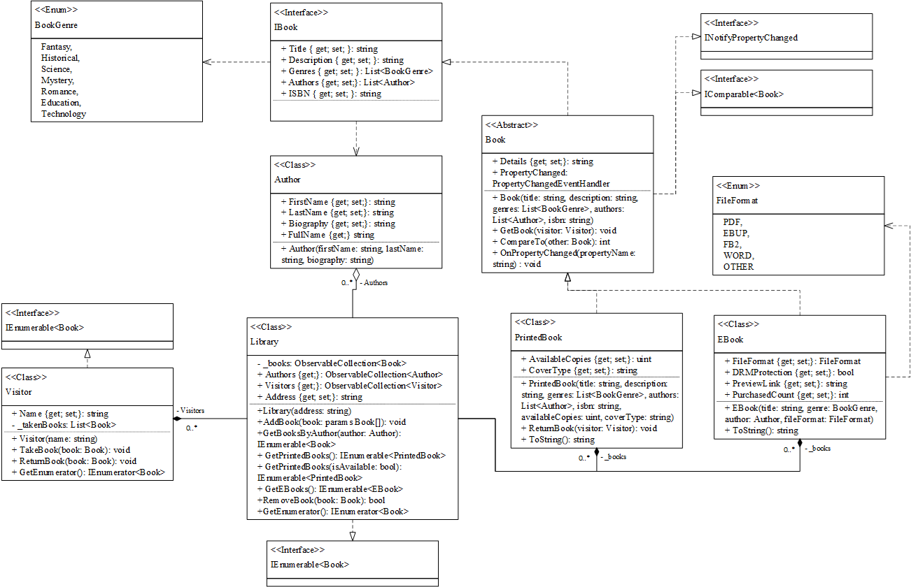

<h1 align="center">Бібліотека</h1>

## Опис предметної області

Система бібліотеки складається з кількох основних об'єктів, таких як книги, автори та видавці. Книги можуть бути двох типів: надрукованими (PrintedBook) та електронними (EBook). Всі книги мають спільні властивості, але для кожного типу існують додаткові особливості.

### Книги

У системі є базовий інтерфейс **IBook**, який містить загальні характеристики книги, такі як назва, жанр, автор. Від цього класу наслідуються два основних типи книг:

- **PrintedBook** — це надруковані книги, які мають фізичні копії та тип обкладинки.
- **EBook** — це електронні книги, які не мають фізичних копій і читаються на електронних пристроях.

### Автори

**Автори** є важливим елементом книг і можуть бути пов'язані з кількома книгами. Кожен автор має ім'я, прізвище і може мати біографію.

### Видавці

**Видавці** — це організації або особи, які публікують книги. Вони мають назву та адресу. Видавець також може бути пов'язаний з кількома книгами.

### Бібліотека

**Бібліотека** (клас **Library**) є контейнером для книг. Вона зберігає колекцію книг і дозволяє додавати, видаляти та шукати книги. Бібліотека може працювати з книгами обох типів — надрукованими та електронними — завдяки поліморфізму.

## Діаграмма класів

